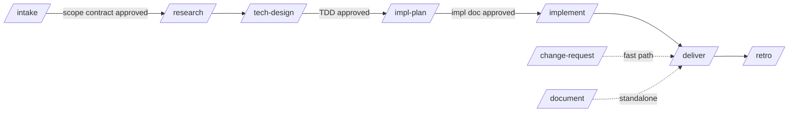

# Software Engineer Stack

A Claude Code skill framework covering the full software engineering lifecycle for codebases spanning **PL/SQL, SQL, KSH, and Python**. It turns a solution design document or requirement brief into researched, designed, implemented, verified, and packaged deliverables — while staying **accurate, fault-tolerant, self-improving, and scope-disciplined**.

## The lifecycle



| Command | What it does | Gate |
|---|---|---|
| `/intake <brief>` | Parse a solution design / requirement brief into a requirements summary and a **scope contract** | User approves scope contract |
| `/research` | Investigate the codebase and external sources; every finding carries a source reference | Checklist |
| `/tech-design` | Produce a technical design document traceable to requirements and research | User approves TDD |
| `/impl-plan` | Produce an implementation document: ordered steps, test plan, rollback plan | User approves impl doc |
| `/implement` | Execute the impl doc step by step on a branch, verifying each step | Code review + verification evidence |
| `/deliver` | Scope audit, evidence bundle, release notes, Word/PDF/Confluence conversion | Scope auditor passes |
| `/change-request <desc>` | Fast path for small changes: impact analysis → mini scope contract → change → verify → deliver | Inline approvals |
| `/document <type> <target>` | Produce a how-to, KB article, or understanding document for an existing interface | Fact-checker passes |
| `/repo-profile` | Scan a work repo and infer its conventions into a cached `.conventions.md` | — |
| `/verify-code <files>` | Run per-language verification (live DB/host where available, static fallback) | — |
| `/retro` | Capture lessons from a finished task into the framework's knowledge base | User approves framework edits |

## Installation

Option A — install as a plugin (recommended):

```sh
claude plugin marketplace add <this-repo-url-or-path>
claude plugin install software-engineer-stack
```

Option B — clone next to your work repos and add it to a session with `claude --add-dir /path/to/software_engineer_stack`, or symlink `skills/` into your project's `.claude/skills/`.

Then open Claude Code **inside the work repo** you're changing and run the commands above.

## Task workspaces

Every engagement (task, change request, doc request) lives in its own workspace directory, `work/<task-id>/`, created by `/intake` (or `scripts/new-task.sh`):

```
work/PROJ-123/
├── STATUS.md          # stage, gate states, next action — the resume point
├── scope-contract.md  # approved at intake; the single source of scope truth
├── research-notes.md
├── tdd.md
├── impl-doc.md
├── evidence/          # captured run outputs, test results, before/after
├── PARKED.md          # out-of-scope findings logged, never acted on
└── deliverables/      # converted docx / pdf / Confluence outputs
```

`STATUS.md` is the resume point: if a session dies mid-stage, rerun the same command and the skill picks up from the recorded state. Add `work/` to the work repo's `.gitignore` if workspaces shouldn't be committed there.

## The four guarantees

- **Accurate** — every factual claim in a generated document must carry a source reference (`file:line`, doc section, or captured run output). Code is verified by running it (`/verify-code`), and the `doc-fact-checker` agent re-verifies documents against the code before a stage closes.
- **Fault-tolerant** — stages are idempotent and resumable via `STATUS.md`; implementation happens on a branch with checkpoint commits; every impl doc has a rollback section.
- **Self-improving** — `/retro` appends structured lessons to `knowledge/lessons.md`; every skill loads applicable lessons before starting. Retro can also propose edits to templates/checklists, applied only with your approval.
- **Scope-disciplined** — `/intake` produces a scope contract you approve; every later skill re-reads it. Anything discovered out of scope goes to `PARKED.md`, never into the change. The `scope-auditor` agent gates `/deliver`.

## Environment configuration for live verification

Connection details are **never stored in this framework**. Verification recipes read them from the environment of the machine you run Claude Code on:

| Variable | Used for | Example |
|---|---|---|
| `SES_DB_CONN` | `sqlplus`/`sql` (SQLcl) connect string for the dev schema | `scott@//devdb:1521/DEVPDB` (password via wallet or prompt) |
| `SES_KSH_HOST` | Optional ssh host for running KSH scripts | `devuser@unixdev01` |
| `SES_PY` | Python interpreter for the work repo | `~/.venvs/proj/bin/python` |

If a variable is unset or the environment is unreachable, `/verify-code` falls back to static checks and says so in the evidence file.

## Repository layout

```
skills/       one directory per lifecycle command (SKILL.md each)
agents/       scope-auditor, code-reviewer, doc-fact-checker (read-only reviewers)
templates/    canonical Markdown templates for every document type
standards/    default coding standards per language (a repo's .conventions.md overrides them)
checklists/   per-stage quality gates
knowledge/    lessons.md (self-improvement memory), decisions.md (framework decision log)
scripts/      new-task.sh, md2docx.sh, md2pdf.sh, md2confluence.sh
examples/     sample work repo + a fully worked example task workspace
```

## Document conversion

Deliverables are authored in Markdown and converted on `/deliver`:

```sh
scripts/md2docx.sh work/PROJ-123/tdd.md          # → deliverables/tdd.docx
scripts/md2pdf.sh  work/PROJ-123/tdd.md          # → deliverables/tdd.pdf
scripts/md2confluence.sh work/PROJ-123/tdd.md    # → deliverables/tdd.confluence.txt
```

The scripts require [pandoc](https://pandoc.org) (and a LaTeX engine for PDF); they print install instructions if it's missing.
