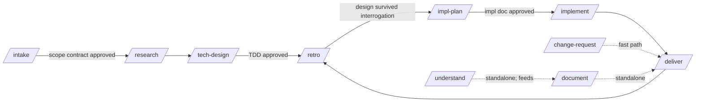

# Software Engineer Stack

A Claude Code skill framework covering the full software engineering lifecycle for codebases spanning **PL/SQL, SQL, KSH, and Python**. It turns a solution design document or requirement brief into researched, designed, implemented, verified, and packaged deliverables — while staying **accurate, fault-tolerant, self-improving, and scope-disciplined**.

## The lifecycle


```mermaid
flowchart LR
    A[/intake/] -->|scope contract approved| B[/research/]
    B --> C[/tech-design/]
    C -->|TDD approved| G[/grill/]
    G -->|design survived interrogation| D[/impl-plan/]
    D -->|impl doc approved| E[/implement/]
    E --> F[/deliver/]
    F --> G[/retro/]

    CR[/change-request/] -.fast path.-> F
    DOC[/document/] -.standalone.-> F
    UND[/understand/] -.standalone; feeds.-> DOC
```

| Command | What it does | Gate |
|---|---|---|
| `/intake <brief>` | Parse a solution design / requirement brief into a requirements summary and a **scope contract** | User approves scope contract |
| `/research` | Investigate the codebase and external sources; every finding carries a source reference | Checklist |
| `/tech-design` | Produce a technical design document traceable to requirements and research | User approves TDD |
| `/grill` | Adversarial interrogation of the TDD: concrete edge-case scenarios per category (data, lifecycle, interface, temporal, environment, security/ops); gaps fixed from evidence, the rest grilled out of you until answered or explicitly deferred | Zero open questions |
| `/impl-plan` | Produce an implementation document: ordered steps, test plan, rollback plan | User approves impl doc |
| `/implement` | Execute the impl doc step by step on a branch, verifying each step | Code review + verification evidence |
| `/deliver` | Scope audit, evidence bundle, release notes, Word/PDF/Confluence conversion | Scope auditor passes |
| `/change-request <desc>` | Fast path for small changes: impact analysis → mini scope contract → change → verify → deliver | Inline approvals |
| `/understand <interface>` | Build a code-verified working understanding of any existing interface or integration: trace it end-to-end, map dependencies both directions, explain it in layers, answer follow-ups from the code | — |
| `/document <type> <target>` | Produce a how-to, KB article, or understanding document for an existing interface | Fact-checker passes |
| `/repo-profile` | Scan a work repo: conventions into `.conventions.md`, core business entities seeded into `.domain-glossary.md` | — |
| `/verify-code <files>` | Run per-language verification (live DB/host where available, static fallback) | — |
| `/retro` | Capture lessons from a finished task into the framework's knowledge base | User approves framework edits |

### Tool skills

Not lifecycle stages — no workspace, no gate, no `STATUS.md`. They wrap an
external system so the stages (and you) can reach it. Both need Atlassian
credentials in the environment (see below) and Python's `requests`.

| Command | What it does |
|---|---|
| `/jira-ops` | Read, search, create, comment on, transition, assign and bulk-manage Jira issues (REST v3 / ADF). Transitions on issues assigned to someone else are blocked without `--force`. |
| `/confluence-ops` | Read pages as Markdown, search by CQL, create/update pages, publish mermaid diagrams as rendered SVG attachments. |

## Installation

Option A — install as a plugin (recommended):

```sh
claude plugin marketplace add <this-repo-url-or-path>
claude plugin install software-engineer-stack
```

Option B — clone next to your work repos and add it to a session with `claude --add-dir /path/to/software_engineer_stack`, or symlink `skills/` into your project's `.claude/skills/`.

Then open Claude Code **inside the work repo** you're changing and run the commands above. New here? Read the [narrated walkthrough](docs/walkthrough.md) of a full task first.

## Using with GitHub Copilot

Three tiers, by effort. Canonical content is always `skills/`/`agents/` —
everything Copilot-facing is generated from it (never edit generated files).

**Tier A — install as a plugin (recommended, zero setup).** The ready-made
[`copilot/`](copilot/) folder is a self-contained Copilot-native
[plugin](https://docs.github.com/en/copilot/concepts/agents/about-plugins):
`plugin.json`, the 14 stages as skills, the 3 reviewers as `.agent.md` custom
agents, and the bundled templates/checklists/protocol they use.

```sh
copilot plugin install ./copilot     # from a local checkout
copilot plugin install <repo-url>    # or straight from the repository
```

No generator run needed. Components are cached — re-run the install after
updating. For the Copilot coding agent, enable the plugin via the work repo's
`.github/copilot/settings.json`. (Installing this repo's root also works:
Copilot reads `.claude-plugin/plugin.json` for Claude Code compatibility and
defaults skills to `skills/` — but only the `copilot/` folder carries the
reviewers as custom agents, since plugin agents require `.agent.md` naming.)

**Tier B — generate the adapter into a work repo** (adds VS Code Chat
`/stage` commands and repo-scoped discovery):

```sh
python3 scripts/build_copilot.py --target /path/to/your/work-repo
```

This writes `.github/prompts/<stage>.prompt.md` (explicit `/intake`,
`/implement`, … in Copilot Chat — enable prompt files, prefer agent mode),
`.github/skills/<stage>/SKILL.md` (model-invoked
[agent skills](https://docs.github.com/en/copilot/how-tos/copilot-cli/customize-copilot/add-skills)),
`.github/agents/<name>.agent.md` (the reviewers as
[custom agents](https://docs.github.com/en/copilot/reference/custom-agents-configuration)),
and `.github/copilot-instructions.md` (shared rules). Path references point
back at this repo — keep it checked out at a stable location and regenerate
after skill edits. Add **`--self-contained`** to instead bundle the framework
data (templates, checklists, protocol, standards, scripts, knowledge) into
`.github/se-stack/` and point every reference there — the work repo then
needs no framework checkout at all, and `/stage` commands still work in
VS Code Chat. (The bundled `knowledge/` is a per-install copy — sync lessons
back to this repo's canonical `knowledge/`.)

**Tier C — any other tool**: the generated root `AGENTS.md` explains the
lifecycle and how to execute the stage instructions directly (opencode and
other AGENTS.md-aware tools).

## Task workspaces

Every engagement (task, change request, doc request) lives in its own workspace directory, `work/<task-id>/`, created by `/intake` (or `scripts/new-task.sh`):

```
work/PROJ-123/
├── STATUS.md          # stage, gate states, next action — the resume point
├── scope-contract.md  # approved at intake; the single source of scope truth
├── research-notes.md
├── tdd.md
├── impl-doc.md
├── evidence/          # captured run outputs, test results, before/after
├── ASSUMPTIONS.md     # proceed-and-log decisions awaiting gate ratification
├── PARKED.md          # out-of-scope findings logged, never acted on
└── deliverables/      # converted docx / pdf / Confluence outputs
```

`STATUS.md` is the resume point: if a session dies mid-stage, rerun the same command and the skill picks up from the recorded state. Add `work/` to the work repo's `.gitignore` if workspaces shouldn't be committed there.

### Which repo is "the repo"

Two paths every stage resolves before touching anything, per [core/repo-resolution.md](core/repo-resolution.md): **`<work-repo>`** (the directory holding `.git`, and with it `.conventions.md` and `.domain-glossary.md`) and **`<workspace-root>`** (the directory holding `work/`, defaulting to `<work-repo>`). Both are recorded absolutised in `STATUS.md` at scaffold time, and later stages read them from there rather than re-deriving from their own working directory.

This matters when your editor workspace is a **parent folder containing several repos** — a supported layout, and the one case where the session's current directory is not a repo at all. There, each repo keeps its own `.conventions.md` (conventions are a property of a repo, not of the workspace), stages take repo-level paths as `<work-repo>/.conventions.md`, and a stage with no `STATUS.md` to read will ask which repo the task is about instead of guessing. See [Q&A #21](docs/QA.md).

### Analysis spans every repo; writing doesn't

Repos share a workspace because they talk to each other, so a task's **analysis** scope is wider than its **write** scope:

- **`<repo-set>`** — every repo under the workspace folder (enumerated by `scripts/list-repos.sh`, recorded in `STATUS.md`). Impact analysis, caller/dependent searches, call graphs, and dependency maps run across ALL of them. A repo searched with no hits is reported as *searched, no references found*, with the command — because a repo nobody searched and a repo with no callers produce the same silence. References are qualified `<repo>:<path>:<line>`.
- **`<changed-repos>`** — the subset the scope contract says may be modified. It starts as the primary repo and grows only with the user's approval at a gate. Each changed repo gets its own branch and follows its own conventions; the impl doc names a repo per step and states the cross-repo deploy order.

Excluding a repo from analysis is a user decision recorded in the contract, never an inference from a repo looking unrelated. See [Q&A #22](docs/QA.md).

## The four guarantees

- **Accurate** — every factual claim in a generated document must carry a source reference (`file:line`, doc section, or captured run output). Code is verified by running it (`/verify-code`), the `doc-fact-checker` agent re-verifies documents against the code before a stage closes, and `/grill` attacks the design's *completeness* — the edge cases nobody wrote down — before implementation is planned.
- **Fault-tolerant** — stages are idempotent and resumable via `STATUS.md`; implementation happens on a branch with checkpoint commits; every impl doc has a rollback section.
- **Self-improving** — `/retro` appends structured lessons to `knowledge/lessons.md`; every skill loads applicable lessons before starting. Retro can also propose edits to templates/checklists, applied only with your approval. Each work repo additionally accumulates a `.domain-glossary.md` — business terms ("purchase order", "approved") mapped to their system reality (tables, states, code paths, confirmed semantics) — so a term explained once is never re-asked.
- **Scope-disciplined** — `/intake` produces a scope contract you approve; every later skill re-reads it. Anything discovered out of scope goes to `PARKED.md`, never into the change. The `scope-auditor` agent gates `/deliver`.

## When the agent doesn't know

Every skill follows the shared [decision protocol](core/decision-protocol.md).
The short version:

1. **Checkable facts get checked** — if reading code or running a query can
   answer it, that happens; confidence estimates are reserved for genuine
   judgment calls.
2. **Proceed + log** (no interruption) only when the call is ~90%+ confident
   AND cheaply reversible AND inside the scope contract AND touches nothing
   dangerous (data changes, external contracts, prod). The assumption is
   recorded in the workspace's `ASSUMPTIONS.md` with its basis, impact-if-wrong,
   and reversal step.
3. **Stop and ask** for everything else — genuinely unknown, irreversible or
   high blast-radius (regardless of confidence), scope-affecting, or
   user-reserved. Blocking questions ask immediately; the rest batch at stage
   boundaries.
4. **Every approval gate ratifies open assumptions** — you see what was
   assumed before you sign off, and nothing is delivered on an unratified
   guess (the scope auditor enforces it).
5. `/retro` reviews corrected assumptions as calibration feedback, so
   over-confidence turns into lessons.

## Environment configuration for live verification

Connection details are **never stored in this framework**. Verification recipes read them from the environment of the machine you run Claude Code on:

| Variable | Used for | Example |
|---|---|---|
| `SES_DB_CONN` | `sqlplus`/`sql` (SQLcl) connect string for the dev schema | `scott@//devdb:1521/DEVPDB` (password via wallet or prompt) |
| `SES_KSH_HOST` | Optional ssh host for running KSH scripts | `devuser@unixdev01` |
| `SES_PY` | Python interpreter for the work repo | `~/.venvs/proj/bin/python` |

The Atlassian tool skills read their own set the same way — nothing is stored
in the framework, and the helpers exit with the full list if anything required
is missing:

| Variable | Used for | Example |
|---|---|---|
| `JIRA_URL` | Atlassian site for `/jira-ops` (and `/confluence-ops`, at `<site>/wiki`) | `https://your-org.atlassian.net` |
| `JIRA_EMAIL` | Atlassian account email | `you@your-org.example` |
| `JIRA_TOKEN` | Atlassian API token — works for Jira and Confluence | from id.atlassian.com |
| `CONFLUENCE_URL` | Only if Confluence is not at `<JIRA_URL>/wiki` | `https://wiki.your-org.com` |
| `JIRA_PROJECT`, `JIRA_NOTIFICATION_PROJECTS`, `CONFLUENCE_SPACES` | Optional defaults | `PROJ`, `PROJ1,PROJ2`, `TEAM,ARCH` |

If a variable is unset or the environment is unreachable, `/verify-code` falls back to static checks and says so in the evidence file.

## Repository layout

```
skills/       one directory per command (SKILL.md each; tool skills also ship utils/)
agents/       scope-auditor, code-reviewer, doc-fact-checker (read-only reviewers)
templates/    canonical Markdown templates for every document type
core/         decision-protocol.md (what to do when unknown), repo-resolution.md (where the files are)
standards/    default coding standards per language (a repo's .conventions.md overrides them)
checklists/   per-stage quality gates
knowledge/    lessons.md (self-improvement memory), decisions.md (framework decision log)
docs/         QA.md (design Q&A + testing guide), walkthrough.md (narrated example task)
scripts/      new-task.sh, list-repos.sh (analysis scope), md2docx.sh, md2pdf.sh, md2confluence.sh
examples/     sample work repo + a fully worked example task workspace
```

## Document conversion

Deliverables are authored in Markdown and converted on `/deliver`:

```sh
scripts/md2docx.sh work/PROJ-123/tdd.md          # → deliverables/tdd.docx
scripts/md2pdf.sh  work/PROJ-123/tdd.md          # → deliverables/tdd.pdf
scripts/md2confluence.sh work/PROJ-123/tdd.md    # → deliverables/tdd.confluence.txt
```

The scripts require [pandoc](https://pandoc.org) (and a LaTeX engine for PDF); they print install instructions if it's missing.
