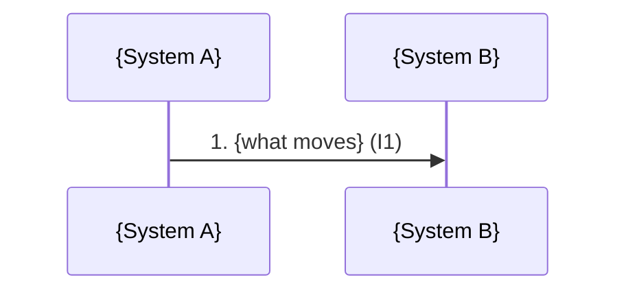

# High-Level Architecture — {ID}: {TITLE}

- Status: draft | user-approved ({date})
- Inputs: {brief / problem statement path}; platform inventory
  `<estate-root>/.platform-capabilities.md` profiled {date}
- Grounding: grounded | **UNGROUNDED — no platform inventory; every mechanism
  is ASSUMED** (user decision, {who}, {date})
- Author: Claude, reviewed by {user}

> **Altitude.** Systems, the data that moves between them, the mechanism that
> moves it, and who owns what. NOT classes, tables, columns, DDL, signatures,
> or pseudocode — those belong to /tech-design, per work package (§13). If a
> section starts needing a column name to make sense, it is too low.
>
> **Claim types.** Every statement in §3–§7 is one of:
>
> - `VERIFIED` — existing behaviour, cites `<repo>:<file>:<line>` or a doc.
>   The fact-checker verifies these against the code.
> - `PROPOSED` — the design itself: something to be built or changed. Needs no
>   source, but must never be worded as if it already exists.
> - `EXTERNAL` — a statement about a system or team outside our control.
>   Carries `{who}, {date}`, or is marked `unconfirmed` and appears in §12.
>
> **Closed world.** Every mechanism in §5 resolves to a row in the platform
> inventory with status `in-use` or `available`. Anything else lives in §9 only.

## 1. Context & goals

{The problem in two or three sentences, for a reader who has not seen the brief.}

- Outcomes this architecture must enable: {…}
- Non-goals: {adjacent things a reader might assume are included}
- Business terms relied on (`<work-repo>/.domain-glossary.md`): {…}

## 2. System context

<!-- Who and what is involved, nothing internal. New/changed systems marked
     with :::new / :::changed. Every node here appears in §3; every edge here
     is a row in §5 — the fact-checker cross-checks both directions. -->

```mermaid
flowchart LR
    classDef new stroke-dasharray: 5 5
    classDef changed stroke-width:3px
    {actor or upstream} -->|{what, I1}| {system}
    {system} -->|{what, I2}| {downstream}
```

## 3. Systems in play

| System | Role in this solution | New / changed / unchanged | Owner | Can we change it? | Claim |
|---|---|---|---|---|---|
| {ORDERS} | {source of approved POs} | unchanged | {Procurement IT} | no — integrate around | VERIFIED ({platform-capabilities §2}) |

## 4. End-to-end flow

<!-- The main path from trigger to final effect, across system boundaries.
     Number the steps; each step names the §5 integration it uses. -->



| Step | What happens | Integration | Claim |
|---|---|---|---|
| 1 | {…} | I1 | {PROPOSED} |

## 5. Integration inventory

<!-- The core of the document: one row per arrow in §2. Mechanism MUST cite
     a platform inventory §1 row that is in-use or available. "Failure &
     recovery" is never blank — at this altitude it is the question that
     decides between mechanisms. -->

| # | From → To | What moves | Mechanism | Capability row (status) | Sync / async | Trigger & frequency | Volume | Failure & recovery posture | Owner | Claim |
|---|---|---|---|---|---|---|---|---|---|---|
| I1 | {A → B} | {daily approved POs} | {extract file over SFTP} | {File transfer — SFTP (in-use)} | async | {Control-M, 02:00 daily} | {~40k rows/day} | {B rejects whole file on bad trailer; A re-sends on next run; ops alerted} | {team} | PROPOSED |

### Reference patterns reused

| Integration | Pattern (platform inventory §3) | Working example |
|---|---|---|
| I1 | {Nightly extract → SFTP → loader} | {repo-a:bin/run_balance_extract.ksh} |

## 6. Data ownership & authority

<!-- For each business entity that crosses a boundary: which system is the
     source of truth, and which only hold copies. Two systems both claiming
     authority for the same entity is a finding, not a detail. -->

| Entity | Authoritative system | Copies held by | Freshness of copies | Claim |
|---|---|---|---|---|
| {purchase order} | {ORDERS} | {B (T+1)} | {daily} | {VERIFIED / PROPOSED} |

## 7. Boundaries

- Ownership boundaries: {which team operates which side of each integration}
- Trust / security boundaries: {where data crosses network zones or
  organisations; sensitive data per integration; how each side authenticates}
- Operational boundaries: {who is paged when I1 fails}

## 8. Key decisions

<!-- Mini-ADRs. Only decisions that shape the architecture — not ones /tech-
     design will make. Durable ones are offered to knowledge/decisions.md. -->

### D1 — {decision title}

- Context: {the force that requires a choice}
- Options: {A; B; C}
- Chosen: {B}
- Why: {evidence-based reasons — platform inventory rows, reference patterns, NFRs}
- Consequences: {what this makes easy, what it makes hard}

## 9. Alternatives requiring new platform capability

<!-- The ONLY place a mechanism outside the inventory's in-use/available set
     may appear. Each row is a costed trade-off for the user, not a
     recommendation slipped past the closed-world rule. Empty is fine — and
     "none considered" is a legitimate answer. -->

| Alternative | REQUIRES NEW PLATFORM CAPABILITY | What it would improve | Approval path & lead time (platform inventory §7) | Why not chosen now |
|---|---|---|---|---|
| {event-driven PO feed} | {message broker — status: absent} | {latency T+1 → minutes} | {architecture board, ~2 quarters} | {no latency requirement justifies the cost} |

## 10. Non-functional fit

<!-- Against the house NFRs in platform inventory §6 — one line each, "n/a"
     stated with a reason, never implied. -->

- Batch windows: {I1 runs 02:00–02:20, inside the 02:00–04:00 window}
- Volumes & growth: {…}
- Availability / SLA: {…}
- Sensitive data / PII: {…}
- Audit & retention: {…}

## 11. Risks

| Risk | Likelihood | Impact | Mitigation |
|---|---|---|---|

## 12. Open questions & assumptions

<!-- At this altitude the unknowns ARE part of the deliverable. Each one names
     where it gets answered: /research, a team, or the user. -->

| # | Question / assumption | Affects | Answer by | Status |
|---|---|---|---|---|
| Q1 | {Does B accept files on weekends? (EXTERNAL, unconfirmed)} | I1 | {B's team} | open |

## 13. Deliberately left to design

<!-- The intricacies this document refuses to decide, so readers don't take
     silence for a decision. Each lands in a work package's /tech-design. -->

- {exact extract file layout — WP1 tech-design}
- {error table structure on the loader side — WP2 tech-design}

## 14. Work packages

<!-- How this architecture becomes tasks. Each package goes through /intake
     with this document as part of its brief, and covers specific §5 rows. A
     §5 row covered by no package is either out of scope (say so) or missing. -->

| WP | Covers integrations | Repo(s) likely to change | Depends on | Notes |
|---|---|---|---|---|
| WP1 | I1 (sending side) | {repo-a} | — | {…} |

## 15. Stress pass

<!-- System-level edge cases per integration, same categories as /grill but
     at architecture altitude: does the DESIGN have an answer, not the code.
     Verdicts: covered (cite §) | fixed (cite the edit) | open (→ §12). -->

| # | Integration | Category | Scenario | Verdict | Where |
|---|---|---|---|---|---|
| X1 | I1 | lifecycle | {A's extract runs twice for the same day} | {covered} | {§5 I1 failure posture} |
